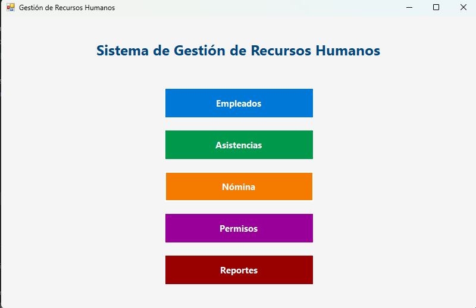
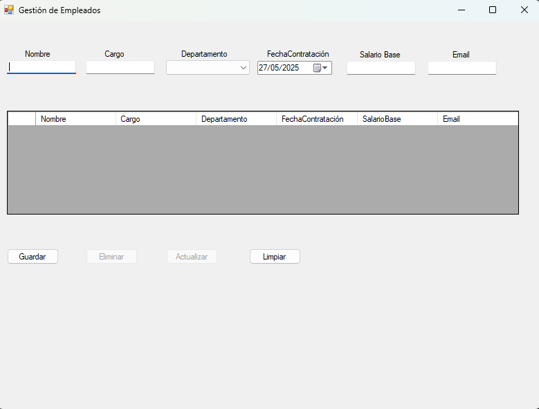
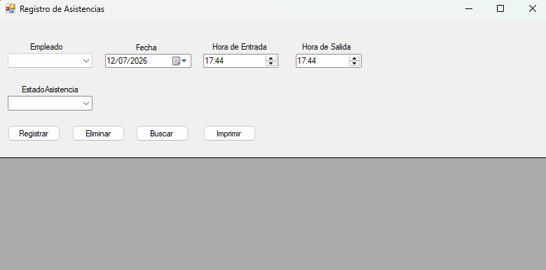
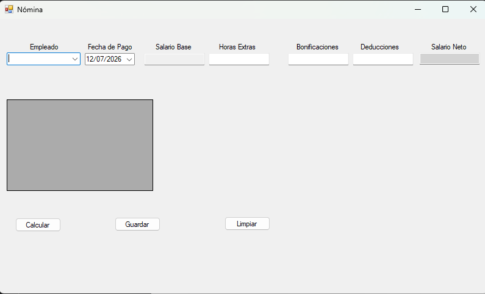
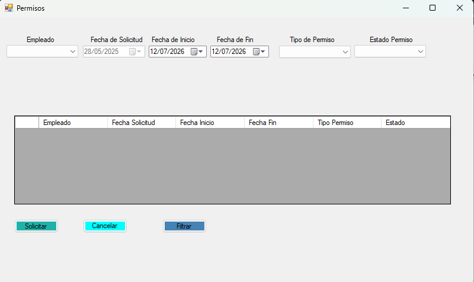
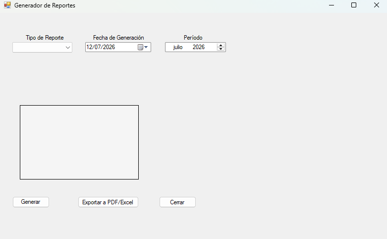

# Sistema de Gestión de Recursos Humanos

Proyecto final de **Herramientas II** — Aplicación de escritorio desarrollada en **C# con Windows Forms** para la gestión integral de recursos humanos.

---

## Capturas de pantalla

### Menú Principal


### Gestión de Empleados


### Asistencias


### Nómina


### Permisos


### Reportes


---

## Tecnologías utilizadas

| Tecnología | Versión |
|---|---|
| C# / .NET Framework | 4.7.2 |
| Windows Forms | — |
| SQL Server Express | 2019 / 2022 |
| Visual Studio | 2022 |

---

## Estructura del proyecto

```
GestiónRecursosHumanos/
├── Form1.cs                  # Menú principal con navegación
├── Form1.Designer.cs         # Diseño del menú principal
├── ConexionBD.cs             # Clase estática de conexión a SQL Server
├── App.config                # Cadena de conexión a la base de datos
├── FrmEmpleados.cs           # Formulario de gestión de empleados
├── Asistencias.cs            # Formulario de control de asistencias
├── Nómina.cs                 # Formulario de cálculo de nómina
├── Permisos.cs               # Formulario de gestión de permisos
├── Reportes.cs               # Formulario de reportes
├── Program.cs                # Punto de entrada de la aplicación
└── Properties/               # Configuración del ensamblado
```

---

## Base de datos

La aplicación usa **SQL Server Express** con la base de datos `GestionRecursosHumanos`.

### Tablas

| Tabla | Descripción |
|---|---|
| `Empleados` | Datos del personal (nombre, cargo, departamento, salario, etc.) |
| `Asistencias` | Registro de entrada/salida por empleado y fecha |
| `Nomina` | Cálculo de salario bruto, deducciones y salario neto por periodo |
| `Permisos` | Solicitudes de permiso con fecha, motivo y estado |

### Script de creación

```sql
CREATE DATABASE GestionRecursosHumanos;
GO
USE GestionRecursosHumanos;
GO

CREATE TABLE Empleados (
    IdEmpleado   INT IDENTITY(1,1) PRIMARY KEY,
    Nombre       NVARCHAR(100) NOT NULL,
    Apellido     NVARCHAR(100) NOT NULL,
    Departamento NVARCHAR(50),
    Puesto       NVARCHAR(100),
    FechaIngreso DATE,
    Salario      DECIMAL(10,2),
    Telefono     NVARCHAR(20),
    Email        NVARCHAR(100)
);

CREATE TABLE Asistencias (
    IdAsistencia INT IDENTITY(1,1) PRIMARY KEY,
    IdEmpleado   INT FOREIGN KEY REFERENCES Empleados(IdEmpleado),
    Fecha        DATE NOT NULL,
    HoraEntrada  TIME,
    HoraSalida   TIME,
    Estado       NVARCHAR(20)
);

CREATE TABLE Nomina (
    IdNomina     INT IDENTITY(1,1) PRIMARY KEY,
    IdEmpleado   INT FOREIGN KEY REFERENCES Empleados(IdEmpleado),
    Periodo      NVARCHAR(50),
    SalarioBruto DECIMAL(10,2),
    Deducciones  DECIMAL(10,2),
    SalarioNeto  DECIMAL(10,2),
    FechaPago    DATE
);

CREATE TABLE Permisos (
    IdPermiso   INT IDENTITY(1,1) PRIMARY KEY,
    IdEmpleado  INT FOREIGN KEY REFERENCES Empleados(IdEmpleado),
    TipoPermiso NVARCHAR(50),
    FechaInicio DATE,
    FechaFin    DATE,
    Motivo      NVARCHAR(255),
    Estado      NVARCHAR(20)
);
```

---

## Configuración y ejecución

### Requisitos previos
- Visual Studio 2022
- SQL Server Express (`localhost\SQLEXPRESS` o el nombre de tu instancia)
- .NET Framework 4.7.2

### Pasos para ejecutar

1. **Clonar el repositorio**
   ```bash
   git clone https://github.com/wilsonOssa/GestionRecursosHumanos.git
   ```

2. **Crear la base de datos**  
   Ejecuta el script SQL de la sección anterior en SQL Server Management Studio.

3. **Configurar la conexión**  
   Edita `GestiónRecursosHumanos/App.config` y reemplaza el nombre del servidor con el tuyo:
   ```xml
   <add name="GRHConnection"
        connectionString="Server=TU_SERVIDOR\SQLEXPRESS;Database=GestionRecursosHumanos;Integrated Security=True;"
        providerName="System.Data.SqlClient"/>
   ```

4. **Compilar y ejecutar**  
   Abre `GestiónRecursosHumanos.sln` en Visual Studio y presiona **F5**.

---

## Módulos del sistema

- **Empleados** — Registro, edición y eliminación de empleados por departamento (RH, TI, Ventas, Contabilidad).
- **Asistencias** — Control de entrada y salida del personal por fecha.
- **Nómina** — Gestión del pago de salarios con cálculo de deducciones.
- **Permisos** — Solicitud y aprobación de permisos laborales.
- **Reportes** — Visualización de información consolidada del sistema.

---

## Autor

**Wilson Ossa**  
Proyecto Final — Herramientas II

